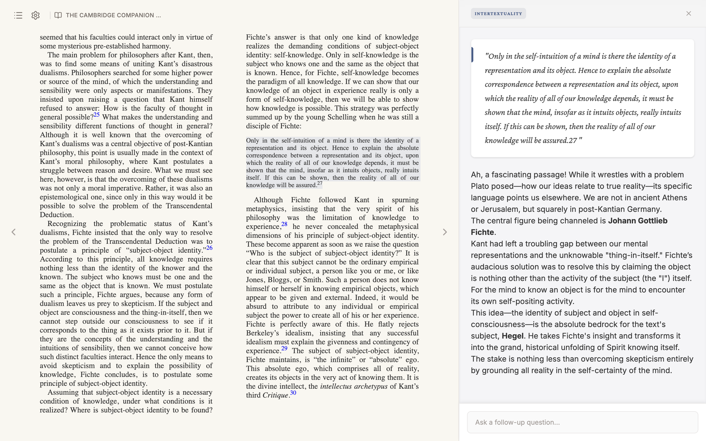

# Locus - Hermeneutic Engine

**Locus** is a local-first, AI-powered e-reader designed for deep reading ("Exegesis").


## Features Implemented (MVP)

*   **Digital Neo-Classic Design**: A distraction-free interface with "Porcelain" background and serif typography (Crimson Pro).
*   **EPUB Rendering**: Full support for paginated EPUB reading using `epub.js`.
*   **Drag & Drop Ingestion**: Simple file loading interface.
*   **Contextual Action Menu**: Highlight text to reveal the "Lens" selector (Philology, History, Logic, etc.).
*   **Sidebar Integration**: A unified workspace for annotations and AI interaction.

## Getting Started

1.  Navigate to `locus-app`.
2.  Install dependencies:
    ```bash
    npm install
    ```
3.  Run in Development Mode:
    ```bash
    npm run dev
    ```
4.  Build for Production:
    ```bash
    npm run build
    ```

## Project Structure

*   `src/renderer/src/components`: UI Components (Reader, DropZone, ActionMenu).
*   `src/renderer/src/store`: Zustand state management (`useBookStore`).
*   `src/renderer/src/assets`: Tailwind CSS configuration (`main.css`).

## Next Steps

*   Implement the API Service to connect the "Lenses" to an LLM (OpenAI/Gemini).
*   Add "Settings" to store User API Keys.
*   Implement local JSON persistence ("Sidecar" files) for notes.
